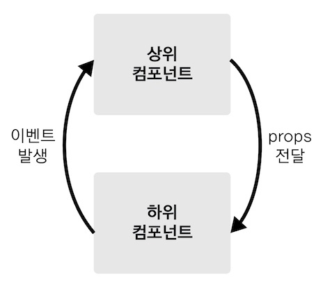

# 섹션3 컴포넌트
> 인스턴스 생성시 개발자 도구에서 Root 컴포넌트로 인식

### 전역 컴포넌트 vs 지역 컴포넌트
* 전역 컴포넌트는 모든 인스턴스에서 사용할 수 있다.
  지역 컴포넌트는 특정 인스턴스 내부에서만 사용할 수 있다.
--- 
#### 전역 컴포넌트 
* Vue.compoent() 로 등록한다.
* 플러그인이나 라이브러리 형태로 전역으로 사용해야 하는 컴포넌트만 이렇게 작성한다. 여러 인스턴스에서 공통으로 사용 가능하다.
~~~
Vue.component('컴포넌트 이름 ',{
    컴포넌트 내용
})
~~~

#### 지역 컴포넌트
* compoents로 등록한다.
* 복수형 
* 보통은 컴포넌트를 여러개를 등록하기 때문에 components 로 작성한다.
* 지역 컴포넌트는 하단에 어떤 것이 등록 되는지 알 수 있다.
* 특정 인스턴스 내부에서만 사용 가능하다.
~~~
new Vue({
   components:{ // 지역컴포넌트 
       '컴포넌트 이름': 컴포넌트 내용
   }
}) 
~~~

### 컴포넌트 통신
> 뷰 컴포넌트는 각각 고유한 데이터 유효 범위를 갖는다. 따라서 데이터 주고 받기 위해선 아래와 같은 규칙을 따른다.
> 
> 
* 상위에서 하위 데이터 내려줌 - 프롭스 속성 
* 하위에서 상위 이벤트 올려줌 - 이벤트 발생

> 위 2가지가 Vue에서 데이터 흐름 추적의 어려움을 줄이기 위한 수단

#### props
* 위에서 아래로 데이터 통신을 위한 방법
* reactivity가 반영됨

사용법
~~~
<app-header v-bind:프롭스속성이름="상위 컴포넌트의 데이터 이름"></app-header>
~~~

#### event emit
* 아래에서 위로 데이터 통신을 위한 방법
~~~
<app-header v-on:하위컴포넌트 발생 이벤트이름="상위 컴포넌트 메서드 이름"></app-header>
~~~

#### 참고자료 this
https://www.w3schools.com/js/js_this.asp

https://medium.com/quick-code/understanding-the-this-keyword-in-javascript-cb76d4c7c5e8