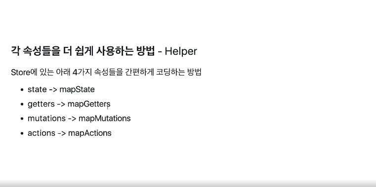
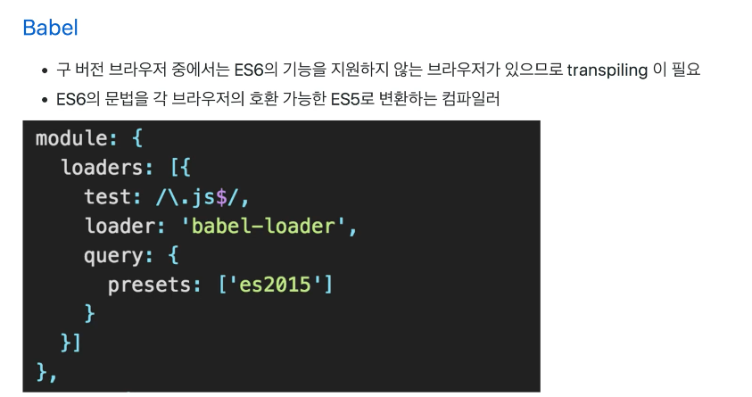
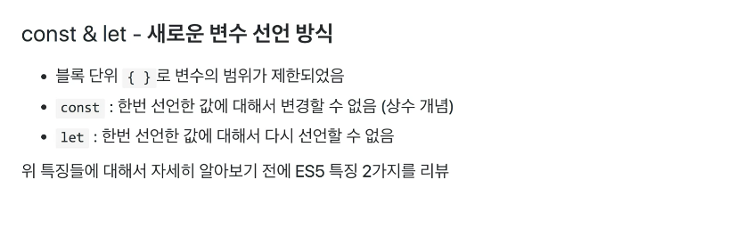
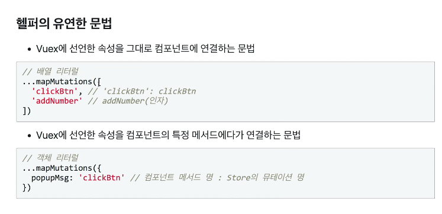
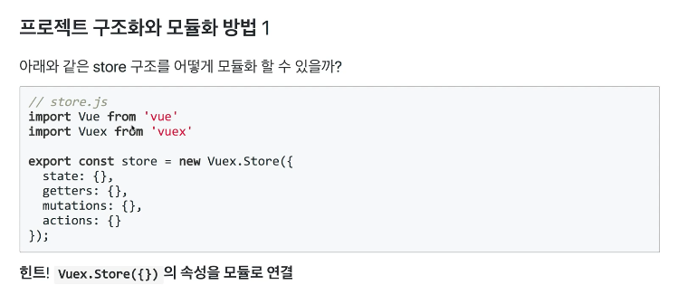
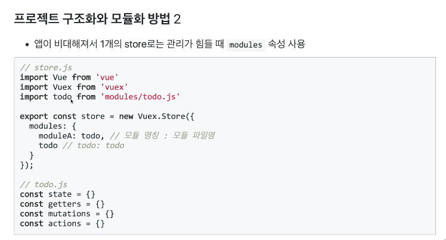
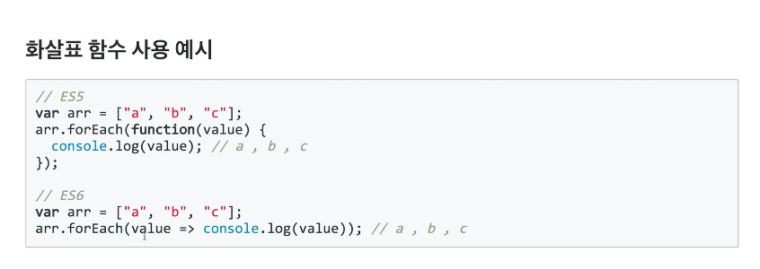
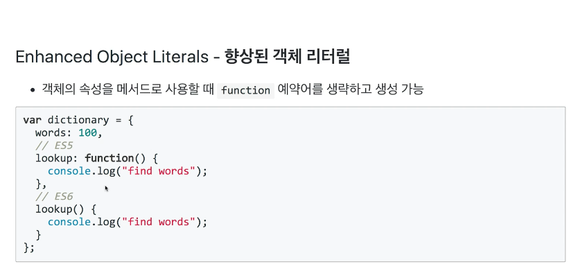
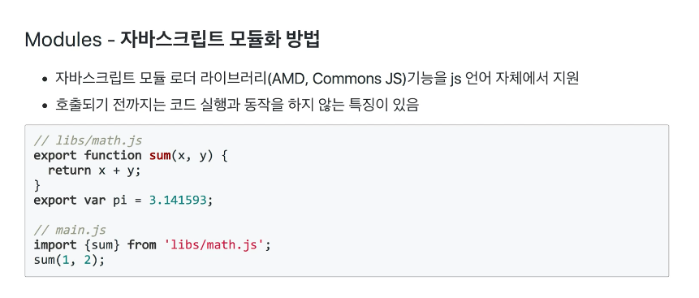
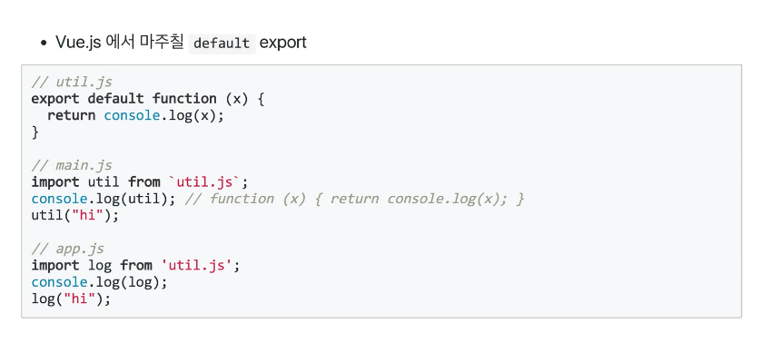

### ES6 란?

> 관련내용으로 원시(primitive), 참조(reference) 타입 자료형
https://velog.io/@22soook00/05.28-%EC%9B%90%EC%8B%9C-%EC%9E%90%EB%A3%8C%ED%98%95-%EC%B0%B8%EC%A1%B0-%EC%9E%90%EB%A3%8C%ED%98%95-%EC%8A%A4%EC%BD%94%ED%94%84

#### const , let 리팩토링
* 반복문 -> let, 디버깅 편의성 -> const

