## Vuex 상태관리 라이브러리
> 복잡해지는 컴포넌트를 관리하기 위함
> - React의 <mark>flux 패턴 </mark>과 비슷
> > fluxus - fluxion - fluent - <mark> flux</mark> - flow : 흐름이란 뜻 &rarr; data를 한방향으로

참고 url &rarr; https://medium.com/hcleedev/web-react-flux-%ED%8C%A8%ED%84%B4-88d6caa13b5b

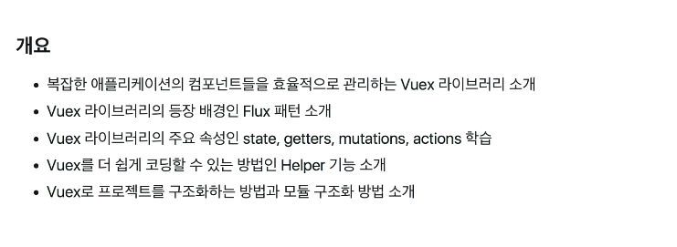

| React | Vue |
| ----- | --- |
| state | data |
| getters | computed | 
| mutations | methods | 
| actions | 비동기(async) methods |

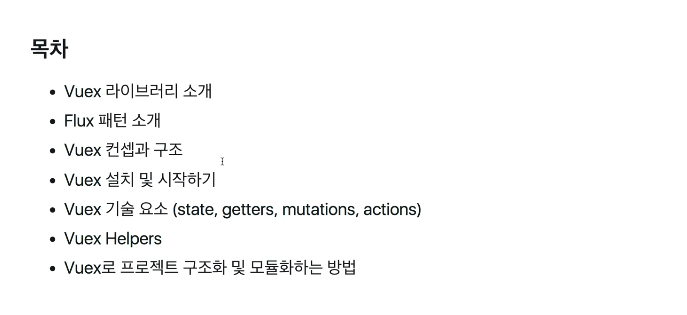

### Flux와 MVC 패턴 소개 및 Flux 등장 배경

#### Vuex란 ? 
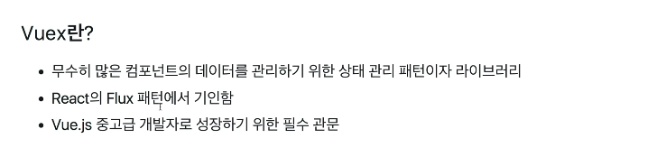

#### Flux란 ?
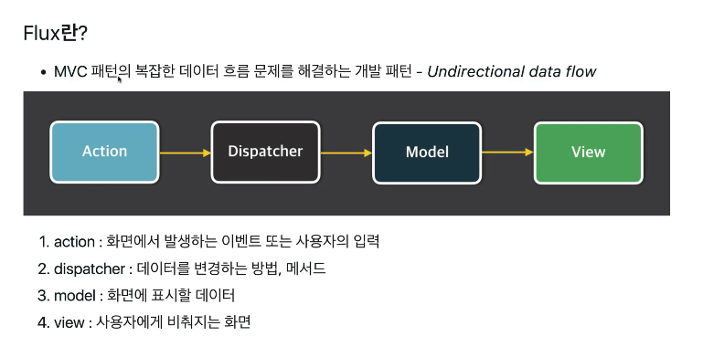
> 한 방향으로 데이터가 흐름

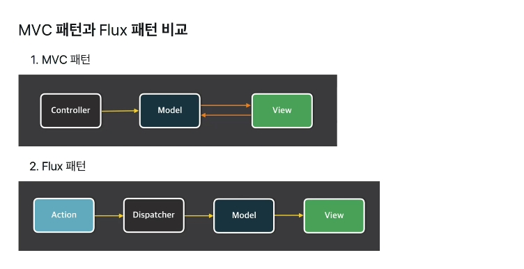

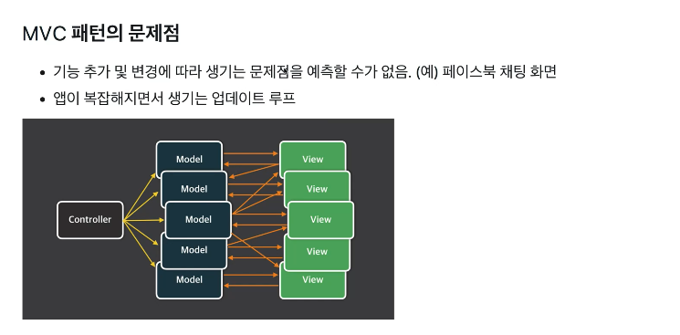
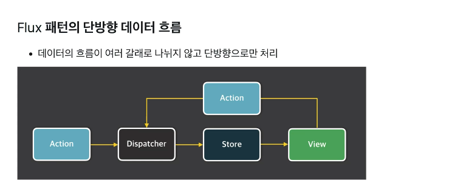
> View &rarr; Action &rarr; Dispatcher &rarr; Store &rarr; View : 이와 같은 싸이클이 반복됨.

### Vuex가 필요한 이유, Vuex 컨셉, Vuex 구조 
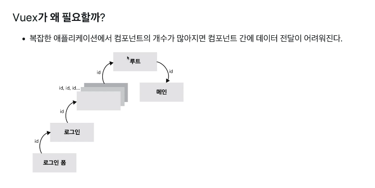

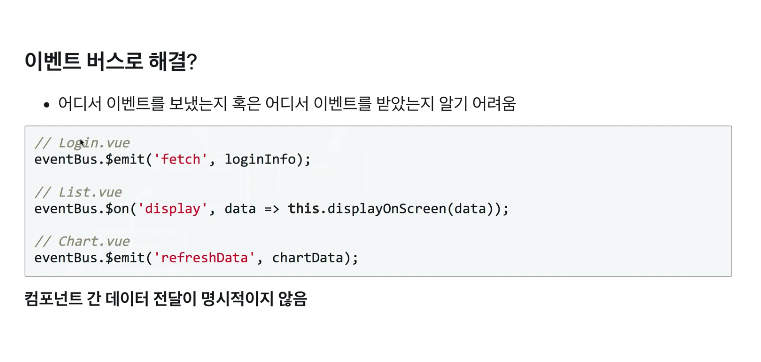

 최소 10개가 넘는 Components 간의 데이터 전달을 외우기 어려움 &rarr; 명시적인 표현이 필요함

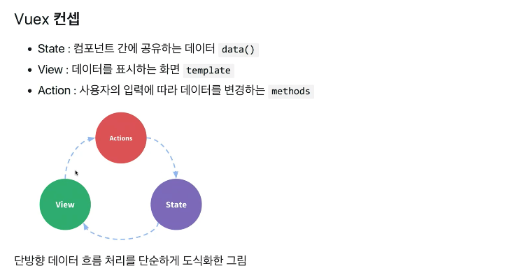
* State &rarr; data 프로퍼티 ex. 추가되는 to-do List
* View &rarr; template ex. 화면(버튼)
* Action &rarr; methods ex. 클릭

ex. 화면(View)에서 버튼 클릭 v-onClick &rarr; addTodo() &rarr; data(to-do list) 추가

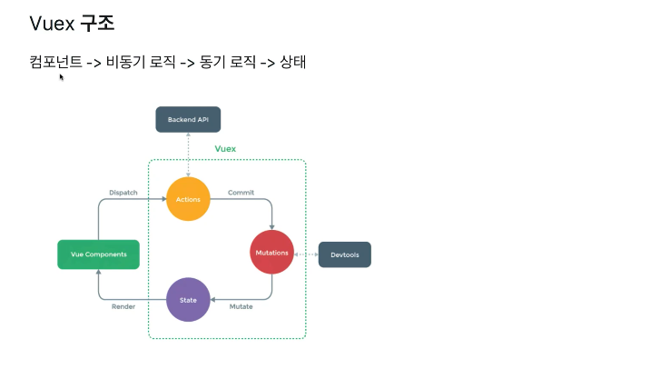
* Actions : 비동기 methods
* Mutations : 동기 methods
* State : 상태
* View Components &rarr; Action &rarr; Mutations &rarr; State &rarr; View Components 순으로 돌아간다.

관련 링크 https://joshua1988.github.io/web-development/javascript/javascript-asynchronous-operation/