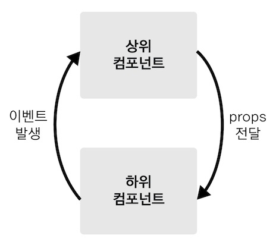

# 섹션3 컴포넌트
> 인스턴스 생성시 개발자 도구에서 Root 컴포넌트로 인식

### 전역 컴포넌트 vs 지역 컴포넌트
* 전역 컴포넌트는 모든 인스턴스에서 사용할 수 있다.
  지역 컴포넌트는 특정 인스턴스 내부에서만 사용할 수 있다.
--- 
#### 전역 컴포넌트 
* Vue.compoent() 로 등록한다.
* 플러그인이나 라이브러리 형태로 전역으로 사용해야 하는 컴포넌트만 이렇게 작성한다. 여러 인스턴스에서 공통으로 사용 가능하다.
~~~
Vue.component('컴포넌트 이름 ',{
    컴포넌트 내용
})
~~~

#### 지역 컴포넌트
* compoents로 등록한다.
* 복수형 
* 보통은 컴포넌트를 여러개를 등록하기 때문에 components 로 작성한다.
* 지역 컴포넌트는 하단에 어떤 것이 등록 되는지 알 수 있다.
* 특정 인스턴스 내부에서만 사용 가능하다.
~~~
new Vue({
   components:{ // 지역컴포넌트 
       '컴포넌트 이름': 컴포넌트 내용
   }
}) 
~~~

### 컴포넌트 통신
> 뷰 컴포넌트는 각각 고유한 데이터 유효 범위를 갖는다. 따라서 데이터 주고 받기 위해선 아래와 같은 규칙을 따른다.
> 
> 
* 상위에서 하위 데이터 내려줌 - 프롭스 속성 
* 하위에서 상위 이벤트 올려줌 - 이벤트 발생

> 위 2가지가 Vue에서 데이터 흐름 추적의 어려움을 줄이기 위한 수단

#### props
* 위에서 아래로 데이터 통신을 위한 방법
* reactivity가 반영됨

사용법
~~~
<app-header v-bind:프롭스속성이름="상위 컴포넌트의 데이터 이름"></app-header>
~~~

#### event emit
* 아래에서 위로 데이터 통신을 위한 방법
~~~
<app-header v-on:하위컴포넌트 발생 이벤트이름="상위 컴포넌트 메서드 이름"></app-header>
~~~

#### 같은 레벨에서의 컴포넌트 통신방법
AppContent -> Root : event
Root -> AppHeader : props

### 라우터

#### 뷰 라우터 등록
뷰 라우터를 설치하고 나면 아래 코드와 같이 라우터 인스턴스를 하나 생성하고 뷰 인스턴스에 등록합니다.
~~~
// 라우터 인스턴스 생성
var router = new VueRouter({
  // 라우터 옵션
})

// 인스턴스에 라우터 인스턴스를 등록
new Vue({
  router: router
})
~~~

#### 뷰 라우터 옵션
위와 같이 라우터를 등록하고 나면 그 다음에 할 일은 라우터에 옵션을 정의하는 일입니다. 대부분의 SPA 앱에서는 아래와 같이 2개 옵션을 필수로 지정합니다.

routes : 라우팅 할 URL과 컴포넌트 값 지정
mode : URL의 해쉬 값 제거 속성
그럼 위 옵션으로 라우터를 정의해보겠습니다.
~~~
new VueRouter({
  mode: 'history',
  routes: [
    { path: '/login', component: LoginComponent },
    { path: '/home', component: HomeComponent }
  ]
})
~~~
위 코드는 라우팅을 할 때 URL에 # 값을 제거하고, URL 값이 /login과 /home일 때 각각 로그인 컴포넌트와 홈 컴포넌트를 뿌려줍니다.

#### router-view
브라우저의 주소 창에서 URL이 변경되면, 앞에서 정의한 routes 속성에 따라 해당 컴포넌트가 화면에 뿌려집니다. 
이 때 뿌려지는 지점이 템플릿의 <router-view>입니다.
~~~

  <router-view></router-view> <!-- LoginComponent 또는 HomeComponent -->

~~~
앞에서 정의한 라우팅 옵션 기준으로 /login은 로그인 컴포넌트를 /home은 홈 컴포넌트를 화면에 표시합니다.

#### router-link
일반적으로 웹 페이지에서 페이지 이동을 할 때는 사용자가 url을 다 쳐서 이동하지 않습니다.
이 때 화면에서 특정 링크를 클릭해서 페이지를 이동할 수 있게 해줘야 하는데 그게 바로 <router-link> 입니다.
~~~
<router-link to="이동할 URL"></router-link>
//실제코드 예시

  <router-link to="/login"></router-link>

~~~

위 코드를 실행하면 화면에서는 <a> 태그로 변형되서 나옵니다. 따라서 <a> 태그를 클릭하면 /login URL로 이동합니다.

> 라우팅을 할때는 Component -> 단일 컴포넌트만 사용할수 있음.
#### 참고자료 this
https://www.w3schools.com/js/js_this.asp

https://medium.com/quick-code/understanding-the-this-keyword-in-javascript-cb76d4c7c5e8